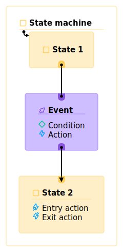
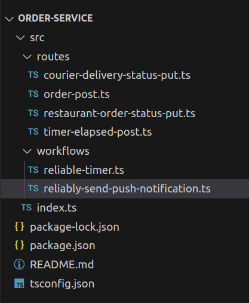
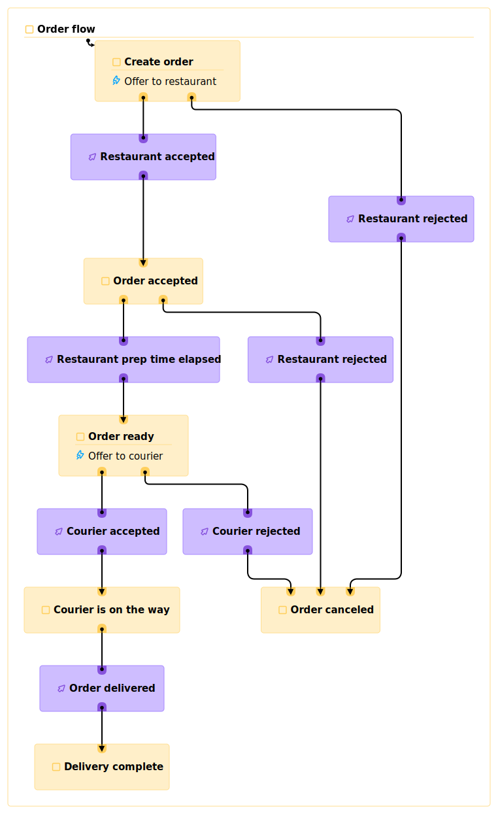
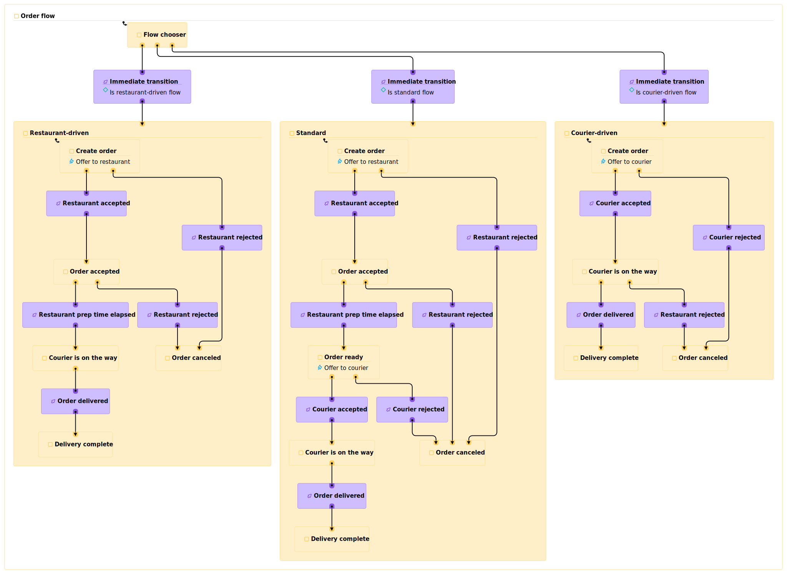
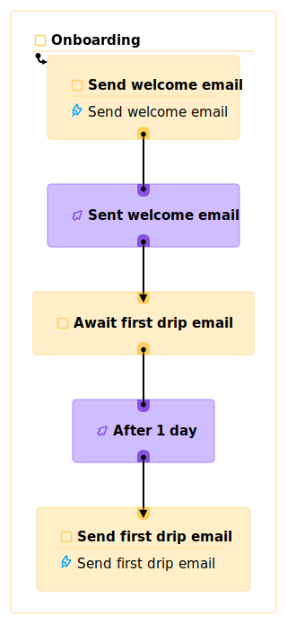
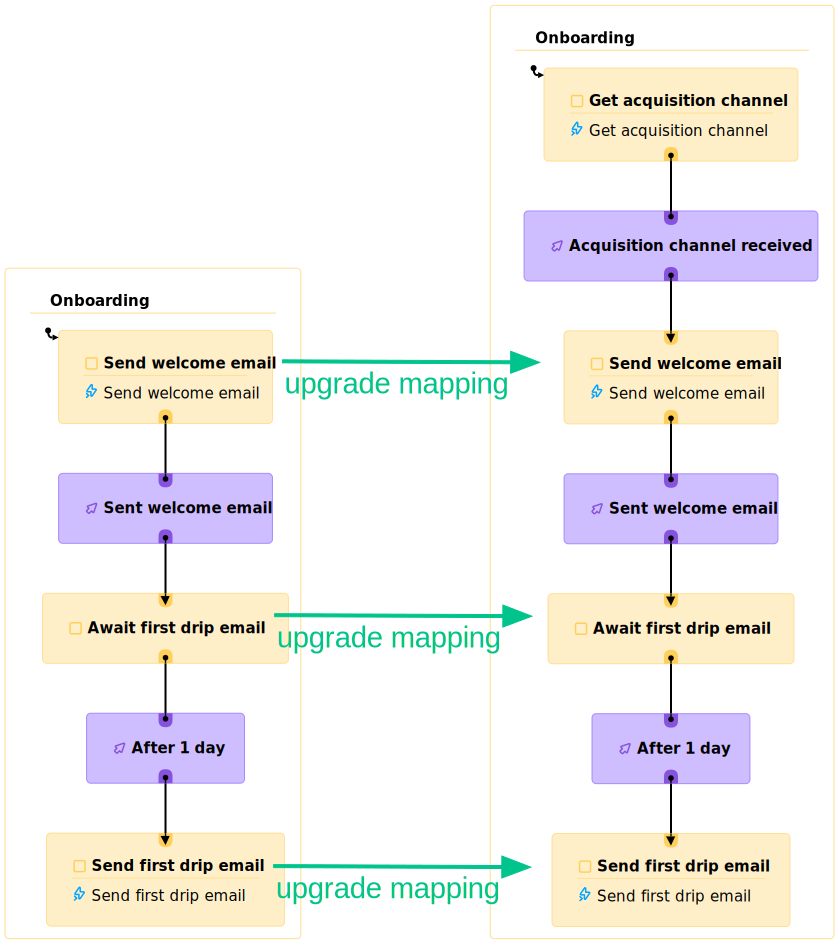

# Your backend should probably be a state machine

Whether you intended to or not, you’re probably building a state machine right now.

That's because any time you have a set of steps with some ordering between them, your system can be represented and built simply and visually as a state machine.

On the frontend, it’s a bit easier to squint and see the states and events you’re modeling. After all, you actually talk about transitions and “paths” the user can take through your app. The mapping from the familiar world of screens and popups and nested components to the language of hierarchical states and transitions is fairly straightforward. So, thankfully, we’ve seen more and more (though not yet enough!) adoption of state machines for modeling frontend flows.

On the backend, however, while it’s just as true that many of the systems we build are implicitly state machines, I’ve yet to see too many teams explicitly model them that way.

I get it. Backend concerns seem quite different. Whiteboards in conference rooms around backend-focused teams are covered in boxes and arrows depicting information flows and architectural dependencies rather than states and transitions.

So many of us backend engineers are so consumed with the mind-boggling concurrency of our systems that we may even scoff at the idea of a system being *in* a “state.” If the frontend seems deterministically Newtonian, the backend seems stubbornly relativistic or, on its worst days, quantum.

But our users most certainly expect that each logical grouping of their data is self-consistent. While we’re thinking about data en masse, our users really care about data in the small - *this* document or *that* ad campaign.

We’re talking about queues, eventual consistency, and reliable timers. All our users care about is having our business logic applied to their data consistently.

There is a better way. And, as is so often the case, it requires a change of perspective, a jump in the level of abstraction at which we’re working.

What we need on the backend is a focus on logic over infrastructure, an investment in dealing with the essential complexity of our business use cases rather than re-addressing the purely accidental complexity of our architecture with every new project.

The mechanism we need to accomplish that is none other than the lowly state machine.

## The five sentence state machine intro

A state machine[^1] consists of possibly nested states and transitions between them and some arbitrary data. Transitions happen in response to events and may have conditions that determine whether they’re active or not. Hierarchy allows for concurrent states. States can define effects that run when the state is entered or exited and transitions can define effects that run when the transition is taken. Those effects can atomically update the state machine’s data or interact with external systems. This structure is easily visualized like this:



## The backend state machine value proposition

We’ll talk about exactly how state machines will help us solve the major classes of problems we face in backend development but, first, let’s look at the high-level value proposition.

> State machines are a mechanism for carefully **constraining** the updates to our **critical data** and the execution of **effects** in a way that allows us to **express** solutions to many classes of problems we encounter and to effectively **reason** about those solutions.

Let's break that down.

1. **Constraints** are actually good. Like, really good. We’re all trying to build systems that perform tasks that people care about and operate in ways that we can understand, not least because we’d really like to fix them when they misbehave. Unconstrained code leaves no bulwark between our too-burdened brains and the chaos of executing 60 billion arbitrary operations per core every second. We all [consider GOTOs harmful](https://homepages.cwi.nl/~storm/teaching/reader/Dijkstra68.pdf) because Djikstra convinced us that we should aim to “make the correspondence between the program (spread out in text space) and the process (spread out in time) as trivial as possible.”

    There are few better ways to simplify the correspondence between what your program looks like and what it does than by constraining your program’s high-level structure to a state machine. With that reasonable constraint in place, it suddenly becomes trivial to understand, simulate, and predict what the systems we build will actually do.

2. **Protect your data and orchestrate your effects**. Just as the infrastructure of our system only exists to support our business logic, our business logic only exists to act on our data and the external world. Data updates are forever and the changes we effect in the world or external systems can have serious repercussions.

   As we saw above, with state machines, data updates and effects are only executed at specific points, with clean error handling hooks, and easy simulation. When you know exactly where and under which conditions these critical actions will happen, your entire system becomes intelligible, invariants become comprehensible, and your data becomes trustworthy.

3. **Reasoning about your system** is not optional. There’s the old adage: “Debugging is twice as hard as writing the code in the first place. Therefore, if you write the code as cleverly as possible, you are, by definition, not smart enough to debug it.” Kernighan said that in the era of standalone programs. How quaint those times seem now. Once you connect two programs together the emergent effects of your *system* - unexpected feedback loops, runaway retries, corrupted data - create a mess many orders of magnitude more “clever” than any one component.

   If we’re going to have any hope of understanding the systems we build - and we better, if we want them to do useful things for people - then we have no option but to constrain ourselves to simple parts. Because they are eminently understandable, state machines are just the right high-level structure for the components of a system you hope to be able to understand.

4. **We left off expressiveness**. Expressiveness is the point at which I hear the groans from the some of the folks in the back. We've all been burned by the promise of a configuration-driven panacea before. What happens when your problem demands you step beyond the paved road that that platform envisioned? And so began the rise of the "everything as code" movement that's now ascendant. It makes sense. You simply can't forego expressivity because expressivity determines your ability to solve the problems you're faced with. It's non-negotiable.

   But *expressivity* is the key, not arbitrary *code* executing in arbitrary ways. State machines are expressive enough to model processes in any domain, naturally. They simply provide the high-level structure within which your code executes. This constraint ensures you can naturally express your logic while preserving your ability to model the system in your head. Even non-engineers can typically understand a system's logic by looking at its state machines.

Now, let's look at the two primary types of backend systems and examine how state machines might form a helpful core abstraction for each. First, we'll examine reactive systems and then proactive systems (aka, workflows).

## Reactive systems

Most of our APIs fall into this camp. Get a request, retrieve or update some data, return a response; they lay dormant until some external event spurs them to act.

Whether we write these as microservices, macroservices, miniliths, or monoliths, we have a bunch of seemingly-decoupled functions responding to not-obviously-connected requests by updating some very-much-shared state.

### A reactive system example

Let's look at an example to understand how state machines can help us build better reactive systems. We’ll walk through the traditional way of building a traditional app: a food delivery service, focusing on the flow of an order.

We’ll simplify the flow to this: users submit an order, we offer it to the restaurant, the restaurant accepts or rejects it, and a bit later, we send the delivery request to a courier and wait until the courier marks the order complete.

To build that in a traditional way, we’ll probably want an order service with endpoints for users to create an order, restaurants to accept an order, couriers to accept a delivery and mark it complete, and timers to notify us that they’ve elapsed.

That is, to wildly simplify what was, in my past job, a few hundred person-years of work, you likely put together some code structured like this:



To represent a process that I’m pretty sure you’re picturing in your head right now like this:



[Expand](./order-state-machine-v1.svg)

### The traditional approach

It *looks like* those endpoints sitting in their separate files are decoupled but, within each route, we have a bunch of assumptions about where we are in the flow. Orders can only be accepted once, couriers need the order information we stored during order acceptance when they pick up the order and shouldn’t be able to accept early since they’re paid based on time spent. We’ll also need to make sure that, if we offer a job to a courier who rejects, they can’t subsequently accept after another courier is assigned.

In short, to be correct, each endpoint must validate aspects of the overall flow so, to coherently understand this system, we need to think about the whole thing - we can't really understand any part in isolation. The overall *process* is what our customers are paying for, not a set of endpoints. Having spent many sleepless nights attending to outages within just such a system, I know first-hand that seemingly innocent changes to a supposedly isolated endpoint can have unintended consequences that ripple through the entire system.

Basically, all of the critical structure *around* and *between* the endpoints that jumps right out at us in the state machine is completely hidden and hard to extract from the "de-coupled" endpoints.

Now, let’s imagine an all-too real request: after building this system, our business team decides that we could offer wider selection faster if we send couriers out to buy items from restaurants we have no relationship with (and, therefore, no way to send orders to directly).

With that feature, we’ve broken all of the assumptions buried in our supposedly de-coupled endpoints. Now, couriers get dispatched first and orders are accepted or rejected after the courier is on their way.

With the traditional structure, we satisfy this new requirement by painstakingly spelunking through each of our endpoints and peppering in the appropriate conditionals, hoping that, in the process, we don’t disrupt the regular orders flowing through our system.

Then, to satisfy restaurants that want to perform their own deliveries, we add a new option: for some orders, instead of dispatching couriers, we give the restaurant the delivery information so they can bring the customer their food. We wade through the mess of conditionals in our “decoupled” endpoints, struggling to trace distinct, coherent flows, painstakingly adding to the confusion as we implement our new feature.

### Doing better

The trouble here lies in the difference between coupling and cohesion. Most systems have some degree of coupling, some interdependent assumptions between different endpoints or components. The degree of coupling is directly related to the difficulty of understanding a part of the system separately from the whole. As it becomes harder to understand *this* endpoint without also understanding *those* endpoints, it becomes more and more important to treat the system as a cohesive whole rather than pretending each part is an isolated component.

**As the coupling between endpoints grows, so too do the benefits of representing the system as an explicit state machine**.

If you’re blessed with a generally stateless problem domain where you can build truly isolated endpoints, you should certainly do so! Our goal is always simplicity in the service of comprehensibility and, by that measure, nothing beats an isolated pure function.

If, however, your problem domain, like most, requires inter-component assumptions, I highly recommend that you architect your system as it is - as a whole - instead of pretending it is composed of isolated pieces. As the dependencies between the endpoints of your system intensify, you’ll find more and more value from representing your requests as events sent to an instance of a state machine and your responses as pure functions of the machine’s state and owned data. In these systems, your primary concern is to understand the inter-component flow and that’s exactly what a state machine provides. You then build truly decoupled data updates, actions and conditions that your state machine orchestrates into a coherent whole.

Returning to our example, it doesn’t take a state machine expert to be able to understand our complex, 3-part flow from this executable diagram but I can assure you that after 6 years in the trenches with the “decoupled” endpoint version of this system, I still struggled to piece together a view of the what the *system* was actually doing.



[Expand](./order-state-machine-v3.svg)

By making this shift, we can solve the general problem of running consistent instances of these machines once and then spend all of our time building the business logic our users actually need.

Which brings us to our second class of system…

## Proactive systems / workflows

Workflows are distinguished by being primarily self-driven. They may wait on some external event occasionally, but the primary impetus driving them forward is the completion of some process or timer they started.

The fundamental problem with workflows is that computers run code as processes and, while processes are permanent(ish) at the timescale of a request, they are decidedly ephemeral at the timescale of a long-lived workflow. We used to string together cron jobs, queues, and watchdogs to ensure forward progress in the face of machine and process failures. That made things work but created a mess - as with the “decoupled” endpoints we saw above, there was no cohesion to the separately-deployed dependencies.

### Workflow engines and the clever hack

In the past few years, we’ve seen the rise of the cohesive workflow as an abstraction in its own right. Just write code and let the workflow engine deal with reliably running on top of unreliable processes. Wonderful! Except that nearly all such platforms suffer from two major flaws: a lack of upgradability and embracing an iffy, leaky abstraction.

There is only one constant across every software project I’ve seen: change. We’ve created this infinitely malleable construct and - of course! - we’re going to take advantage of its amazing ability to change. But there is no coherent upgrade story for *any* major workflow platform. After kicking off a job that’s going to run for a year, there’s no reasonable way to change how it works!

The *best* of these systems allow you to litter your code with version checks to manually recover missing context. *Understanding* is the hardest part of the job and  trying to reason about a workflow littered with “if (version > 1.123) {...}” checks is like betting your business on your ability to win at 3d chess - we shouldn’t need to introduce a time dimension to our code.

This obvious problem of wildly complicated updates derives from the less obvious, more insidious issue with workflow platforms: at their core is a [Shlemiel the painter algorithm](https://www.joelonsoftware.com/2001/12/11/back-to-basics/). They cleverly provide the illusion of resuming your code where it left off but that’s simply not possible with the lack of constraints present in arbitrary code, where any line can depend on arbitrary state left in memory by any code that previously ran. They provide this illusion by running from the beginning on every execution and using stored responses for already-called effects, thereby re-building all of the arbitrary in-process context that your next bit of code might depend on.

It is *clever*!

It is also the *wrong abstraction* because it starts from the assumption that we programmers aren’t open to adopting something better than arbitrary, unconstrained code.

### A better abstraction

With state machines as the core abstraction for workflows, upgrading becomes a simple data mapping exercise because we know *exactly* what any future code depends on: our state and our owned data. We can write one function to map states from the old version to states from the new version and one function to map the owned data from the old version to owned data from the new version. Then we can upgrade instances of our state machine whenever we want and our logic itself can ignore the history of mistakes and rethought features that more rightly belong in our git history than our production deployment.

There’s more. State machines are *inherently resumable* because, again, we know exactly how to rebuild the state that any future execution depends on: just load the state and owned data. No clever tricks required.

### A workflow example

Let’s look at an example of an onboarding workflow we might run with a standard workflow engine today:

```javascript
export async function OnboardingWorkflow(email: string) {
 await sendWelcomeEmail(email);
 await sleep(“1 day”);
 await sendFirstDripEmail(email);
}
```

Now, we decide that we want our welcome email to vary based on the acquisition channel for our user. Simple, right?

```javascript
export async function OnboardingWorkflow(email: string) {
 const acquisitionChannel = await getAcquisitionChannel(email);
 await sendWelcomeEmail(email, acquisitionChannel);
 await sleep(“1 day”);
 await sendFirstDripEmail(email);
}
```

Nope! If a user has already passed the `sendWelcomeEmail` step, workflow execution engines have no choice but to throw an error or send a second welcome email with this change. Let’s see why.

The first time the workflow runs the first version of our workflow, the engine will execute the `sendWelcomeEmail` activity and store its result, then execute the `sleep` activity, which will register a timer and then throw an exception to stop the execution. After the timer elapses, the engine has no way[^2] to jump to the line of code after our call to `sleep`. Instead, it starts at the very top again and uses stored results for any functions it already executed. It *has* to do this because there’s no other way to rebuild all of the program state that we might depend on (e.g. local variables, global variables, arbitrary pointers, etc.). Instead, we’ll need to write our updated version more like this:

```javascript
export async function OnboardingWorkflow(email: string) {
 if (getVersion() < 2) {
    await sendWelcomeEmail(email, defaultAcquisitionChannel);
 } else {
   const acquisitionChannel = await getAcquisitionChannel(email);
   await sendWelcomeEmail(email, acquisitionChannel);
 }
 await sleep(“1 day”);
 await sendFirstDripEmail(email);
}
```

Now imagine that we had more updates (great software engineering teams push multiple changes a day, right?) and imagine that the steps of our workflow had more direct dependencies between them. Maybe you could still mentally model the overall flow after v3. What about after v7?

### Again but with a state machine

With state machines, things are a bit different.

We start with this state machine:



[Expand](./workflow-v1.svg)

For simple workflows, this diagram is helpful but it’s admittedly not a huge improvement in understandability over the code. As things get more complex though, a visual representation of the high-level structure of the workflow is really helpful. More importantly for our analysis here though, this is what an upgrade looks like:



[Expand](./workflow-upgrade.svg)

We make whatever changes we need and then just map our old states to our new states (a trivial mapping in this case). We also run a function to transform the owned data from our prior version to owned data for our new version (if we had used the acquisition channel in future states, we would want to populate the acquisition channel as part of this migration). Because state machines are inherently resumable from any state, we keep our actual workflow implementation clean and separate from our handling of changes over time.

## Putting them together

Examined more broadly, few systems fall entirely into the reactive or proactive camps. An application likely has reactive aspects that kick off proactive processes that wait for reactive events and so forth. With today’s paradigms, these are incredibly awkward to model uniformly, so we tend to create subsystems built around different abstractions with different operational teams with different expertise. Because state machines are driven by *events* and are inherently resumable, they easily model both facets of typical systems within a single paradigm that’s able to naturally express both types of solutions.

## Migrating

Great! So now that you're convinced of the value of state machines, you just need to rewrite your whole backend as a set of state machines in a big, all-at-once migration, right?

Not quite.

You don’t need to *replace* your existing code with state machines. In many cases, you’ll simply want to *wrap* calls to your (simplified) existing code in a state machine. That’s because, for most backends, the entire concept of a flow is simply missing. Once you introduce a state machine that’s responsible for executing the code that previously sat behind your endpoints, you can either update your clients to send events to your new state machine instead of directly invoking endpoints or update the endpoints to send events to the state machine. Then, you can remove the flow-related checks and logic from the former endpoint code that now sits behind your state machine. Finally, you can lift your state management out of the former endpoint code to move ownership of the data to the state machine itself.

Obviously, all of this can be applied just to new projects and migrations can easily be approached piecemeal, wrapping one related set of endpoints at a time.

Just going through the exercise of creating a state machine for a set of endpoints will create valuable insight into the system you thought you knew. The time to finish your next project and lack of outages just might have you hooked.

## Final state

This idea - that state machines could be a natural fit for the high-level structure of systems - has taken a long time to fully form but, having built a platform for running persistent backend state machines, [State Backed](https://www.statebacked.dev), that supports reactive and workflow-based workloads and having built quite a few systems using it, I’m now confident that this is a crucial abstraction for reliable, understandable software systems that are actually productive to work on.

## Getting started

Ready to start implementing your backends as state machines?

The most important first step is to adopt the state machine mindset. Once you start thinking in terms of states and transitions and constraining updates and effects to edges, you'll start to see immediate improvements in your ability to understand your software.

There are some great libraries you can use to build state machines on the backend, including [XState](https://xstate.js.org/docs/).

After thinking about this pattern for a long time, we built [State Backed](https://www.statebacked.dev) to make it incredibly easy to deploy any state machine to the cloud as a reliable workflow or a real-time, reactive backend. We'd be proud to help you adopt state machines for your own backend or we're happy to share notes and help however we can if you choose to build a backend state machine solution yourself.

<div className="container text--center" style={{ marginTop: 40 }}>
    <div id="mc_embed_shell">
    <link href="//cdn-images.mailchimp.com/embedcode/classic-061523.css" rel="stylesheet" type="text/css" />
    <style type="text/css">{`
        #mc_embed_signup{false;clear:left; font:14px Helvetica,Arial,sans-serif; width: 600; margin: auto; max-width: 600px; overflow: hidden;}
        #mc_embed_signup .helper_text { background: none; }
    `}
    </style>
    <div id="mc_embed_signup">
        <form action="https://teampando.us8.list-manage.com/subscribe/post?u=dec43cbfe556d982657100961&id=3616b8513ff_id=00cb72e0f0" method="post" id="mc-embedded-subscribe-form" name="mc-embedded-subscribe-form" className="validate" target="_blank">
        <div id="mc_embed_signup_scroll"><h2>Stay up to date with the latest from State Backed</h2>
            <div className="indicates-required"><span className="asterisk">*</span> indicates required</div>
            <div className="mc-field-group"><label htmlFor="mce-EMAIL">Email Address <span className="asterisk">*</span></label><input type="email" name="EMAIL" className="required email" id="mce-EMAIL" required={true} defaultValue="" /><span id="mce-EMAIL-HELPERTEXT" className="helper_text"></span></div>
            <div id="mce-responses" className="clear">
            <div className="response" id="mce-error-response" style={{ display: "none" }}></div>
            <div className="response" id="mce-success-response" style={{ display: "none" }}></div>
            </div><div aria-hidden="true" style={{ position: "absolute", left: -5000 }}><input type="text" name="b_dec43cbfe556d982657100961_3616b8513f" tabIndex={-1} readOnly value="" /></div><div className="clear"><input type="submit" name="subscribe" id="mc-embedded-subscribe" className="button" value="Subscribe" /></div>
        </div>
        </form>
    </div>
    <script type="text/javascript" src="//s3.amazonaws.com/downloads.mailchimp.com/js/mc-validate.js"></script>
    <script type="text/javascript">{`(function($) {window.fnames = new Array(); window.ftypes = new Array();fnames[0]='EMAIL';ftypes[0]='email';fnames[1]='FNAME';ftypes[1]='text';fnames[2]='LNAME';ftypes[2]='text';fnames[3]='ADDRESS';ftypes[3]='address';fnames[4]='PHONE';ftypes[4]='phone';}(jQuery));var $mcj = jQuery.noConflict(true);`}</script>
    </div>
</div>

[^1]: Technically, we’re talking about statecharts throughout this article because we want the expressivity benefits of hierarchical and concurrent states. We’ll use the more common term just for familiarity.

[^2]: The only exception we’re aware of is [Golem](https://www.golem.cloud/platform), a workflow engine built around Web Assembly. You can't snapshot the memory of a regular process and restore it but, because of Web Assembly’s sandbox model, they are able to capture the full program state and do actual resumption. This is a beautiful abstraction for resumption but doesn't address upgrading running instances.
