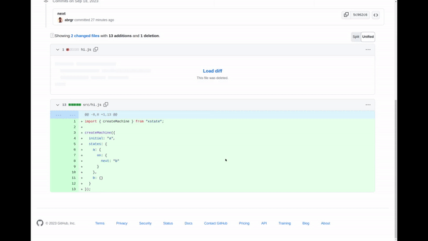

# Introducing... the State Backed visualizer bot

We're excited to announce the release of our completely free GitHub bot to visualize
XState state machines in pull requests!

One of the amazing things about state machines is that your high-level logic becomes pure data
that's easy to visualize to quickly understand.

You can install our bot in about 11 seconds [here](https://www.statebacked.dev/github-visualizer-bot).
Once installed, whenever a PR creates or updates a state machine, you'll see a helpful comment
from the State Backed Visualizer bot with a visualization of the new machine to easily keep
the whole team aligned.

Obviously, we bult the State Backed visualizer bot as a persistent workflow in State Backed!
We found a *really* nice pattern for handling webhooks:
1. Identify the entities in the webhook
2. Map from entity types (e.g. pull request, repo, user) to a State Backed machine definition
3. Create a machine instance for the specific entities in the webhook (e.g. PR 12345 or user 123) if one doesn't already exist
4. Send the machine instance for each referenced entity the webhook as an event

This pattern makes it really easy to keep the state of the entity up to date in your machine instance.
