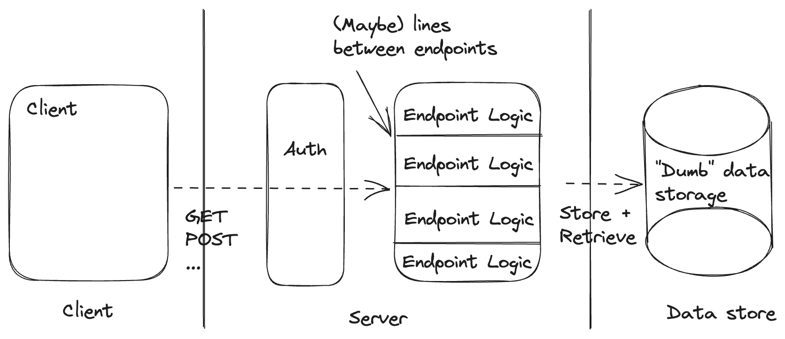

# Architecture is drawing lines

One of the most important decisions in software architecture is deciding where to draw lines.
If we can get the right groupings of concerns, separating the parts we can and keeping the right aspects of our system together, we'll be able to express our solutions more simply and straightforwardly.
In fact, many of the big shifts in the way we think about software architecture can be thought of as drawing different boxes around the same components.

For example:
- The microservices movement advocated drawing a physical box around individual domains, aligning physical architecture with domain structure.
- React advocated removing the line between UI logic and templating and drawing a box around both.
- Document databases advocated moving constraints and schema maintenance into the application code (outside of the data storage box), creating a boundary between them.

Line drawing doesn't change the set of things we can do but it does change the set of simple things we can build and the set of things we can express easily.

Simple things do not cross lines and embody a single concept. Easy things make use of few simple things.

If we see our job as platform builders as [making simple easy](https://www.youtube.com/watch?v=SxdOUGdseq4), drawing lines determines both what simple things we can build and what's easy to build.
So where we draw our lines matters. A lot.

We'll take a look at the boundaries that a traditional backend chooses and how a traditional backend as a service modifies those boundaries to create a different set of tradeoffs.
Finally, we'll discuss a new set of boundaries that define what we're calling the ["smart storage" architecture](#a-smart-storage-architecture) and examine what benefits we get from this new grouping of concerns.

## A traditional backend architecture

The traditional backend draws its top-level lines between the client and the server and between the server and the database.

The simple things we can easily create in this architecture are:
- Named backend operations (e.g. getOrder or updateShoppingCart). These reside entirely within the server and are easy to individually invoke from the client.
- Static constraints on the shape of our data. Our data store has everything it needs to evaluate the constraints before saving our data.
- Authorizing clients to run specific backend operations based on static client claims.

The things we may want to do that this architecture makes complex (non-simple) and hard are:
- Orchestrating multiple backend operations. Even if we build a new endpoint, the orchestration requires both logic and state, which requires crossing the line between our backend and our datastore.
- Dynamic constraints on the evolution of our data. For example, we may want to enforce the constraint that our order status can never go from placed to shipped without first transitioning to fulfilled. We can attempt to enforce this in our server box but it requires support from our data store. Further, if we have drawn some lines between our endpoints, any dynamic constraints will have to cross the lines between every endpoint that deals with the entity we're considering.
- Authorizing clients to run backend operations where the authorization decision requires additional data. This introduces logic and data store access into our authorization layer and requires our authorization layer to know about the internals of our endpoint logic, requiring us to cross quite a few lines.

## A traditional backend as a service architecture

The traditional backend as a service in the model of Firebase, Supabase, etc. collapses the client and server boxes from our "traditional backend," removing the line that had been between them, and moves the authorization box to sit in front of the data store rather than in front of the endpoint logic.

We can see that we have generally the same set of components, just with different boundaries drawn between them.

So what are the simple things that this architecture enables?
- Reads of and updates to individual data items from the client are simple and easy. This is the bread and butter of traditional backends as a service.
- Static constraints on the shape of our data. Our data store *still* has everything it needs to evaluate the constraints on our data, though specific backends as a service vary in their support for this.
- Authorizing clients to view and update individual tables based on static client claims (Supabase has cleverly extended this to support authorization based on arbitrary data by collapsing the authorization and data storage boxes).

And what are the capabilities we likely want that this architecture makes complex and hard?
- Enforcing invariants across entities. The best of the traditional BaaS platforms offer client-side transactions, so it is *possible* for cooperative clients to maintain invariants across entities but, by nature, many of our cross-entity invariants combine aspects of authorization with static schema constraints. This creates a very complex interaction across the line separating "authorization" from "data storage". This means that, even in the best case, it is likely not possible to *prevent* invariant violations across entities with uncooperative clients (i.e. anyone who knows how to open dev tools).
- Dynamic constraints on the evolution of our data. Remember: here we have in mind the example of requiring an order entity to transition to a fulfilled state before being marked as shipped. At least in the traditional backend architecture, it was *possible* to enforce dynamic constraints by creating a complex interaction between endpoints and our data store. Unfortunately, it is incredibly difficult to enforce these constraints at all with the typical BaaS without crossing every single line we've drawn. We could allow running arbitrary code in the authorization layer or data store to inspect the old and new version of every updated record but we would then need to write a validator in the authorization layer for every update that we wanted to write on the client side. At that point, we've essentially re-built our traditional backend but required every endpoint to be built twice.
- Orchestrating backend operations that should outlive the client. Because we don't have any logic running on the server, this is not just hard but impossible without building additional systems.

## A "smart storage" architecture

We've seen that there is quite a lot to like about the traditional backend architecture vs the traditional backend as a service.
We had to sacrifice our ability to control the evolution of our data in order to get the convenience of centralizing our logic (i.e. placing all logic on the client instead of split between client and server).

What if we could re-draw these lines to preserve the things we liked about the traditional backend architecture, expand the set of simple things that could be built easily, and still got the convenience of the traditional backend as a service?

Enter: the "smart storage" architecture.

The primary innovation of the traditional backend as a service over the traditional backend was to remove the line drawn between the client and the server.

In our "smart storage" architecture, we will instead remove the boundary between the server logic and the database. We'll also remove the boundaries between the logic for different endpoints.

When we say that we'll remove the boundary between the server logic and the database, we mean this at a logical layer. We'll make the storage of server logic state automatic and transparent to the server itself by constraining our server logic to look like a reducer, transforming a current state and an event into a new state and a set of effects. We likely still store data in a physically separate data store but, while physical boundaries do matter, the logical boundaries determine the high order bits of what's simple and easy to express.

Our client can send events to our smart storage backend through the authorization layer and can read the storage state.

Since we are still encapsulating all of the backend logic into a box that is easily managed by a platform, our "smart storage" architecture fits nicely as a target for a traditional backend (e.g. while migrating) or as a backend as a service, hit directly by clients.

So what are the simple things made easy by this architecture?
- Arbitrary backend operations can be implemented in one place and invoked by the client (by sending the corresponding event).
- Static constraints on the shape of our data are easy to enforce because all of our transition logic sits in one place and can easily share validations or validations can be performed as part of the transparent storage updates.
- Authorizing clients to run specific operations (send events) is easy because our authorizer has the information it needs at the time of authorization.
- Orchestrating multiple backend operations is easy because all of our transition logic lives in one place and the platform can provide persistent queues and reliable timers to the transition logic on top of our data store access (without crossing any boundaries).
- Enforcing dynamic constraints on the evolution of our data is easy because our data only evolves as dictated by our transition logic, which has no internal boundaries.

What's still complex and hard?
- Enforcing invariants across entities. We've found that this is easier and simpler but still not fully simple or easy. By nature, enforcing a constraint *across* entities involves crossing boundaries and the "smart storage" architecture doesn't change that. However, by modeling storage records as actors with internal logic that can send and receive events, cross-entity communication is a bit more structured and predictable than it otherwise would be. In this architecture, one entity can send an event to another, allowing for structured cross-entity coordination that's at least co-located with the rest of the entity's update logic. When implemented as state machines, there are even [reasonable ways](https://github.com/p-org/P) to prove properties of systems of interacting machines.

## Move fast, don't break things

Much of the convenience of traditional backends as a service centers on the ability to ship quickly, though development speed may slow down over time as the workarounds for hard problems pile up.

We can achieve the same (or better) time to market with a "smart storage" backend as a service and, because we're able to provide simple solutions for more desired capabilities, we don't see the same slow down over time.

Developing with a traditional backend architecture, feature development proceeds by:
1. Defining an interface between the client and backend.
2. Defining a data storage schema.
3. Implementing backend business logic.
4. Implementing the backend storage interface.
5. Building the client.
6. Connecting the client to the backend.

Traditional backends as a service remove the need for (1) and (4), combine (3) and (5), and standardize (6).

"Smart storage" backends as a service remove the need for (1) and (4) and standardize (6).

So, we remove and standardize the same amount of work. Traditional BaaS also combine backend and client-side business logic but, because there is little duplicated between them, we haven't seen this result in a significant savings. In fact, we have seen that this mushing together of business logic on the client can prevent us from preserving crucial invariants about our data. Traditional BaaS also know this, which is why they all offer arbitrary backend functions as a service in addition to the standard backend offering. **With a "smart storage" backend as a service, one architecture provides everything we need to move quickly *and* preserve our data integrity and business rules.**

All together, we expect equivalent initial development times and significantly lower maintenance cost over time from the "smart storage" BaaS architecture.

## Implementation

As we said at the top of this article, the principle components determining how valuable an architecture is tend to be driven by where the boundaries are drawn.
So, regardless of how each component is implemented, we think that there's significant value in this re-thinking of the traditional backend or backend as a service architecture.
However, we've found that the best representation for the transition logic in the "smart storage" architecture is a state machine.

Our goal is always to make our code match our mental model of the solution as closely as possible and, in this case, a state machine with associated data captures exactly how our transition logic is intended to work.

Our model for what our transition logic layer should do is as follows:
Events come in and are processed sequentially. Processing entails applying some logic to the current state and the provided event to generate new state and effects. The new state should be transparently stored and the effects executed, potentially producing new events.

State machines are the right, simple abstraction to easily represent a process that works like that.

## State Backed

We built [State Backed](https://www.statebacked.dev) backend as a service using the "smart storage" architecture and, having built many apps on top of it, we've seen the benefits that we expected first-hand.
More importantly, our clients have too.

You can try out the "smart storage" architecture with [State Backed](https://www.statebacked.dev) now, for free.
Let us know what you think!
